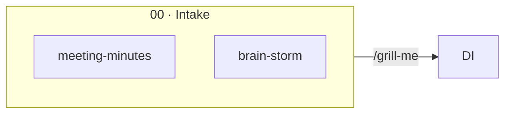

# Pipeline Diagram — Build Guide

Reference for creating new interactive process diagrams in the same style as `requirements_process_demo.html`.

The workflow: write a **source `.md` file** (Mermaid structure + node enrichment), then translate it into the HTML diagram using the code patterns below. See `spec-pipeline-source.md` for a full example.

---

## Input format — source `.md`

Each diagram has two parts in its source file:

**1. Mermaid block** — defines nodes, groups, edges, and edge labels (structural)

```markdown
## Diagram


```

**2. Enrichment block** — per-node role + input/output (powers the click modal)

```markdown
## Enrichment

### intake
**Role**: Source material — everything that exists at the start.  
**Input**:
- Meeting minutes
- Brain-storm notes

**Output**:
- 00_intake/ folder populated
- Input for /grill-me and /intake-to-prd
```

The Mermaid block maps to `NODES` + `E`. The enrichment block maps to `D{}`.

---

## Colors (Bold Agency palette)

| Token | Value | Use |
|-------|-------|-----|
| `--bg` | `#f2f2f0` | Page background (warm gray) |
| `--panel` | `#ffffff` | Canvas / modal background |
| `--line` | `#e0ddd8` | Borders, grid lines |
| `--ink` | `#0d1a1c` | Primary text |
| `--muted` | `#6b7280` | Subtext, labels |
| `--teal` | `#054e5a` | Brand primary — header, buttons |
| `--teal2` | `#0a7a8a` | Document node borders |
| `--gold` | `#e1b77e` | Accent — mark, end nodes |
| `--gold-d` | `#c8984a` | Governance borders, loops |

---

## Node types

| Type | Fill | Text | Border | Use |
|------|------|------|--------|-----|
| `input` | `#054e5a` | `#ffffff` | `#054e5a` | Source artifacts (intake, discovery) |
| `doc` | `#e8f4f6` | `#054e5a` | `#0a7a8a` | Generated documents (PRD, stories…) |
| `gov` | `#fef3e2` | `#7a4a10` | `#9a6020` | Governance artifacts (risk log, ADRs) |
| `end` | `#e1b77e` | `#3d2200` | `#c8984a` | Final output (release readiness) |

```js
const STYLE = {
  input: { fill:"#054e5a", text:"#ffffff", kick:"rgba(255,255,255,.5)",  border:"#054e5a" },
  doc:   { fill:"#e8f4f6", text:"#054e5a", kick:"rgba(5,78,90,.45)",     border:"#0a7a8a" },
  gov:   { fill:"#fef3e2", text:"#7a4a10", kick:"rgba(122,74,16,.45)",   border:"#9a6020" },
  end:   { fill:"#e1b77e", text:"#3d2200", kick:"rgba(61,34,0,.45)",     border:"#c8984a" }
};
```

---

## NODES — definition

```js
const NODES = [
  {
    id:    "prd",           // unique string id (matches Mermaid node id)
    cx:    430,             // center-x on canvas (px)
    cy:    225,             // center-y on canvas (px)
    type:  "doc",           // see table above
    kick:  "02 · SOLUTION", // small label at top of node
    label: "PRD",           // main label in node
    c:     "#0a7a8a"        // glow color (active state)
  },
];

// fixed dimensions — assigned automatically
NODES.forEach(n => { n.w = 170; n.h = 66; NMAP[n.id] = n; });
```

**Layout tips:**
- Horizontal pipeline: 230 px between nodes (cx)
- Vertical layers: 230–250 px apart (cy)
- Side branch downward: same cx as parent, cy + 230
- Adjust `viewBox` to fit: `viewBox="0 80 {width} {height}"`

---

## EDGES — connections

Derived from the Mermaid edge definitions.

```js
const E = [
  {
    id:   "prd_epics",   // convention: "from_to"
    from: "prd",
    to:   "epics",
    fs:   "r",           // from-side: l / r / t / b
    ts:   "l",           // to-side:   l / r / t / b
    // depth: 80         // optional: override curve depth (px)
  },
];
```

**Side selection:**

| Direction | fs / ts |
|-----------|---------|
| Left → right | `r` / `l` |
| Top → bottom | `b` / `t` |
| Diagonal | pick the anchor that produces the cleanest curve |

**Curve depth** — auto-calculated as `clamp(dist * 0.42, 38, 200)`. Override with `depth` when the arc looks wrong. Smaller = tighter, larger = wider arc.

---

## LBLS — edge labels

Manually positioned text labels (maps to Mermaid edge label text).

```js
const LBLS = {
  "prd_epics": [545, 210, "/prd-to-epics"],
  //            x    y    text
};
```

**Positioning:**
- Horizontal edge: x = midpoint between nodes, y = cy − 15 (above line)
- Vertical edge: x = cx − 38 (left of line), y = midpoint cy
- Diagonal: eyeball the midpoint of the bezier curve

---

## LOOPS — feedback arrows

Dashed amber return arrows.

```js
const LOOPS = [
  {
    id:    "l_ac",
    from:  "ac",
    to:    "stories",
    fs:    "t",       // departure side
    ts:    "t",       // arrival side
    depth: 72,        // arc distance
    label: "revise"
  },
];
```

**Rules of thumb:**
- Same-row return: `fs:"t", ts:"t"`, depth ≈ 70 → arc over the top
- Long return (end → start): `fs:"l", ts:"b"`, depth ≈ 180 → wide arc left side

---

## WAVES — animation scenarios

```js
const WAVES = [
  { nodes: ["intake"] },                                // step 1: activate, no incoming edge
  { edges: ["intake_disc"], nodes: ["discovery"] },     // step 2: edge travels, then node lights up
  { edges: ["intake_prd","disc_prd"], nodes: ["prd"] }, // parallel edges
];

const WAVES_FAST = [
  { nodes: ["prd"] },   // fast-track: start mid-pipeline
  // ...
];
```

Wire buttons:

```js
document.getElementById("playNew").onclick  = () => runScenario(WAVES,      "Full Pipeline");
document.getElementById("playFast").onclick = () => runScenario(WAVES_FAST, "From PRD");
```

---

## Timing — animation speed

Default values (medium pace):

```js
const dur = 580;    // ms — dot travels along edge
await sleep(180);   // ms — pause between waves
await sleep(160);   // ms — startup delay
```

**Slower** (recommended for presentations / demos):

```js
const dur = 900;    // ms — slower dot travel
await sleep(300);   // ms — more breathing room between waves
await sleep(200);   // ms — startup delay
```

**Fast** (for quick overview):

```js
const dur = 350;
await sleep(100);
await sleep(80);
```

---

## Fullscreen

Add a fullscreen button to the HUD:

```html
<button class="ctl" id="fullscr">⛶ Fullscreen</button>
```

JS:

```js
const fsBtn = document.getElementById("fullscr");
fsBtn.onclick = () => {
  if (!document.fullscreenElement) {
    document.getElementById("stage").requestFullscreen();
  } else {
    document.exitFullscreen();
  }
};
document.addEventListener("fullscreenchange", () => {
  fsBtn.textContent = document.fullscreenElement ? "✕ Exit Fullscreen" : "⛶ Fullscreen";
  fit(); // recalculate zoom after resize
});
```

CSS — stage in fullscreen mode:

```css
.stage:fullscreen {
  height: 100vh;
  border-radius: 0;
  border: none;
}
```

---

## D — node details (modal content)

Derived directly from the enrichment block in the source `.md`.

```js
const D = {
  prd: {
    role: "What this step or artifact does.",
    in:   ["Input A", "Input B", "/slash-command"],
    out:  ["Output X → path/to/file.md", "Output Y"]
  },
  // key = node id
};

const TAG = { input:"ARTIFACT", doc:"DOCUMENT", gov:"GOVERNANCE", end:"DELIVERY" };
```

---

## Buttons (HUD)

```html
<button class="ctl primary" id="playNew">▶ Full Pipeline</button>
<button class="ctl" id="playFast">▶ From PRD (fast-track)</button>
<button class="ctl" id="reset">↺ Reset</button>
<button class="ctl" id="fullscr">⛶ Fullscreen</button>
<div class="zoom">
  <button class="ctl" id="zout">−</button>
  <button class="ctl" id="zin">+</button>
</div>
```

Classes: `ctl` = base style, `ctl primary` = teal filled.

---

## Canvas dimensions

```html
<svg id="svg" viewBox="0 80 {W} {H}" xmlns="http://www.w3.org/2000/svg">
```

```js
const W = 1280; // match your viewBox width
function fit() { zoom = clamp((stage.clientWidth - 2) / W, 0.5, 1); applyZoom(); }
window.addEventListener("load", fit);
```

Set `W` and `H` to your layout's bounding box + ~60 px margin on all sides.

---

## Checklist for a new diagram

1. Write source `.md` — Mermaid block + enrichment block per node
2. **Define `NODES`** — id, cx/cy, type, kick, label, c
3. **Set canvas viewBox** to node spread + margin
4. **Define `E`** — from/to with correct fs/ts, derived from Mermaid edges
5. **Add `LBLS`** for edge annotations (slash commands or labels)
6. **Add `LOOPS`** for feedback arrows (optional)
7. **Populate `D`** — role, in, out per node id (from enrichment block)
8. **Write `WAVES`** (and optional fast-track) in causal order
9. **Set timing** — adjust `dur` and `sleep` for desired pace
10. **Add fullscreen button** to HUD, wire JS + CSS
11. **Wire buttons** — labels and `runScenario()` calls
12. **Update legend** — chips matching types used
13. **Test** — click every node, run all scenarios, zoom, fullscreen
