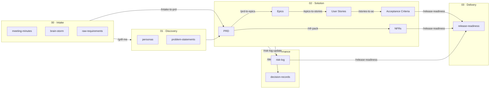

# Spec Pipeline — Source

Source file for `requirements_process_demo.html`. Contains the structural diagram (Mermaid) and per-node enrichment (role + input/output for the click modal).

---

## Diagram

---

## Enrichment

### intake
**Type**: input  
**Kick label**: 00 · INTAKE  
**Role**: Source material — everything that exists at the start. Raw input before any AI transformation.

**Input**:
- Meeting minutes
- Brain-storm notes
- Raw requirements
- Stakeholder input

**Output**:
- 00_intake/ folder populated
- Input for /grill-me and /intake-to-prd

---

### discovery
**Type**: input  
**Kick label**: 01 · DISCOVERY  
**Role**: Deeper understanding of the problem and target audience, generated via /grill-me.

**Input**:
- 00_intake/ files
- /grill-me slash command

**Output**:
- Personas → 01_discovery/personas/
- Problem statements → 01_discovery/problem-statements/

---

### prd
**Type**: doc  
**Kick label**: 02 · SOLUTION  
**Role**: Central Product Requirements Document — the foundation for all downstream artifacts.

**Input**:
- 00_intake/ + 01_discovery/ files
- /intake-to-prd slash command

**Output**:
- 02_solution/prds/\<feature\>_PRD.md
- Confirmed facts + assumptions
- Questions for Stakeholders

---

### epics
**Type**: doc  
**Kick label**: 02 · SOLUTION  
**Role**: Business capability slices derived from the PRD. No technical implementation details.

**Input**:
- PRD
- /prd-to-epics slash command

**Output**:
- 02_solution/prds/\<feature\>_epics.md
- Epics with objective, scope, dependencies, risks, acceptance boundaries

---

### stories
**Type**: doc  
**Kick label**: 02 · SOLUTION  
**Role**: Sprint-ready user stories per epic — vertical slices, no technical task breakdowns.

**Input**:
- Epics
- /epics-to-stories slash command

**Output**:
- 02_solution/user-stories/\<feature\>_stories.md
- User story format + acceptance intent + non-goals

---

### ac
**Type**: doc  
**Kick label**: 02 · SOLUTION  
**Role**: Given/When/Then acceptance criteria per story, including negative and boundary cases.

**Input**:
- User stories
- /stories-to-ac slash command

**Output**:
- 02_solution/acceptance-criteria/\<feature\>_ac.md
- Positive and negative paths
- Boundary conditions, role-based behavior

---

### nfrs
**Type**: doc  
**Kick label**: 02 · SOLUTION  
**Role**: Non-functional requirements: performance, security, privacy, reliability, observability.

**Input**:
- PRD
- /nfr-pack slash command

**Output**:
- 02_solution/nfrs/\<feature\>_nfr.md
- Measurable NFR criteria per category
- Explicitly flagged unknowns

---

### risks
**Type**: gov  
**Kick label**: 04 · GOVERNANCE  
**Role**: Delivery, scope, data and dependency risks with mitigation and owner.

**Input**:
- PRD, epics, stories, NFRs
- /risk-log-update slash command

**Output**:
- 04_governance/risk-log/\<feature\>_risks.md
- Risks with likelihood, impact, mitigation, owner

---

### adrs
**Type**: gov  
**Kick label**: 04 · GOVERNANCE  
**Role**: Architecture Decision Records — explicit decisions with context and alternatives considered.

**Input**:
- Solution context
- /decision-record slash command

**Output**:
- 04_governance/decision-records/\<decision\>.md
- Context, decision, alternatives, rationale, consequences

---

### release
**Type**: end  
**Kick label**: 03 · DELIVERY  
**Role**: Go/no-go checklist for release: functional, data, security, support readiness, known limitations.

**Input**:
- Acceptance criteria + NFRs + Risk log + ADRs
- /release-readiness slash command

**Output**:
- 03_delivery/release-notes/\<feature\>_readiness.md
- Functional & security readiness
- Known limitations
